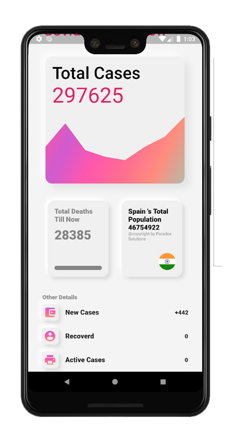
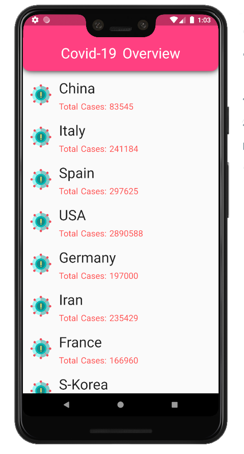
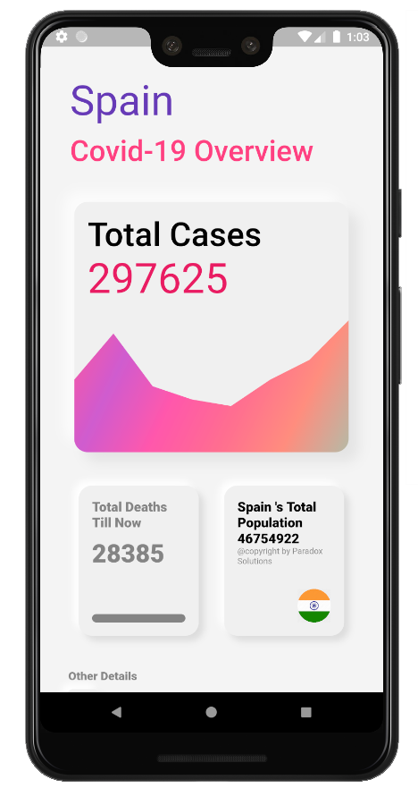
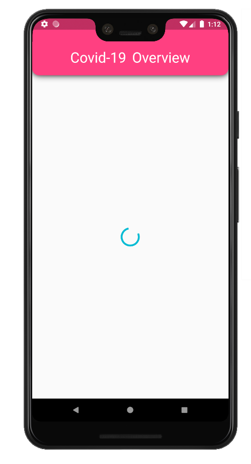

#flutter Application
# covid19_report 

This application, you will get every country's Covid-19 Status like total deaths, total cases, and all that stuff.

## Getting Started

Here You will Get:

 Separate Service class for getting Data from Rest API
aA custom app bar and use it as a reusable widget.
Page slide animation. (Custom Page Route )
Future Builder
Listview Builder
Custom Listtile
Clay Container
Abstract Design
 

A few resources to get you started if this is your first Flutter project:

##Screenshoot

